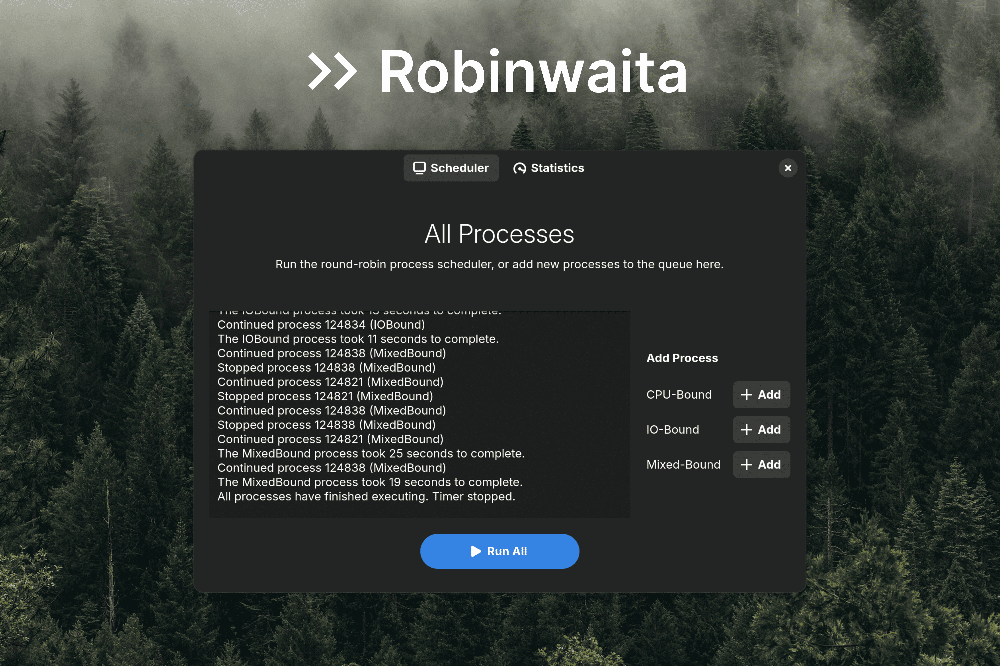

# Robinwaita
Robinwaita is user-friendly round-robin process scheduler for Linux written in C. It comes with a modern Libadwaita & GTK 4-based user interface.

## Screenshots



## Details
* Easily add processes to the scheduling queue
* Round-robin scheduling algorithm, with context switches initiated by `timerfd`
* See how processes get managed by the algorithm in real-time
* Modern GTK 4 interface with light and dark modes
* Check basic statistics like total context switches in a separate tab

## Motivation for this project
* Before we get into anything -- yes, this project is useless. I know.
* That being said, given the additional low-level programming experience I've been getting recently, as well as my growing experience with operating systems concepts, I wanted to challenge myself by programming a process scheduler from scratch.
* I've also loved GNOME and its technologies like GTK for several years. I've thought about making a GTK app for a while now, so combining the two seemed like a fun fit. Ultimately, while the user interface for this project is undeniably basic, I'm still really happy with how it turned out.

## Try Robinwaita for yourself
### Dependencies
* Robinwaita has been developed with the following versions of these packages:
    * `libadwaita`/`libadwaita-devel` version 1.5
    * `libgtk-4-dev`/`gtk4-devel` 4.14
    * `libglib2.0-dev`/`glib2-devel`
    * `libgio-unix-2.0-dev`/`gio-unix-devel` 2.0
    * `libgraphene-1.0-dev`/`graphene-devel` 1.0
    * `python3-dev`/`python3-devel` 3.12.6
    * `gcc` 14.2.1
    * `cmake` 3.28.2
    * `pkg-config`/`pkgconf-pkg-config`
* Other versions may work, but I provide no guarantees.
* I provide an ARM64 build under Releases, but it's expected your system still satisfies dependencies above.
* My build environment was a Fedora 40 VM under Parallels on my M2 Pro MacBook Pro.

### Building the project
1. Clone the repository:
```
git clone https://
cd robinwaita
```
2. Install dependencies:
* Install the dependencies noted above. Keep in mind these instructions are different across distributions, so instructions aren't provided here.
3. Generate the build system using CMake, and build:
```
mkdir build
cd build
cmake ..
cmake --build .
```
4. Run the application:
```
chmod +x robinwaita # set file as executable
./robinwaita # run it! (you can also open it from your file manager)
```